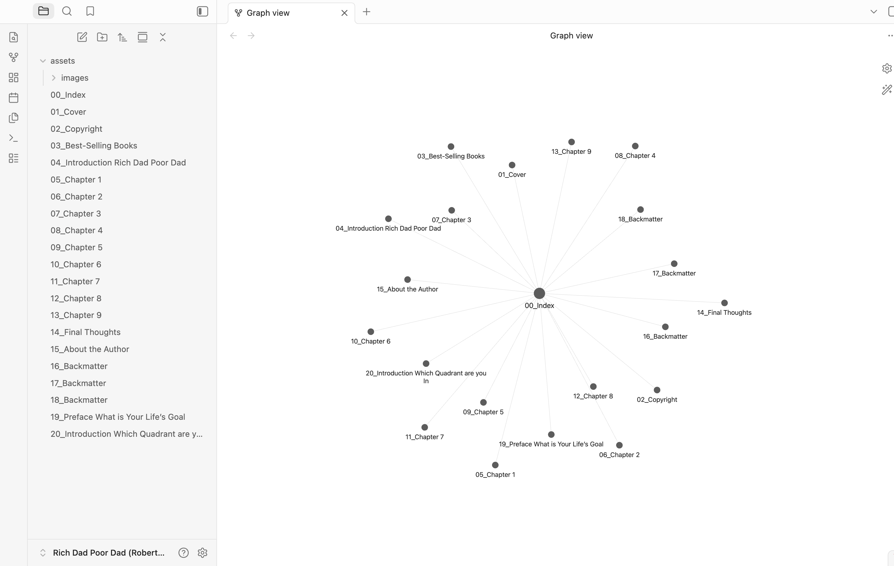

<div align="center">

# tome2md

### Turn any book into a clean, chapter-split Obsidian vault — fully local

**_Your library becomes a knowledge base, not a pile of PDFs._**

<p>


</p>

<p>
<a href="https://github.com/ElBaldo1/tome2md/actions/workflows/ci.yml"></a>


<a href="https://github.com/ElBaldo1/tome2md/stargazers"></a>
</p>

</div>

**`tome2md`** batch-converts a folder of books — **PDF, EPUB, DOCX, ODT, RTF,
HTML, FB2, MOBI/AZW3 (via Calibre), TXT, Markdown** — into a proper
**Obsidian vault**: one Markdown note per chapter, a linked index, extracted
images, and clean text. No cloud upload, no API key, no account. It runs
entirely on your machine, so you can feed an entire bookshelf — including
scanned or DRM-free personal copies — into a local knowledge base or a RAG
pipeline without any of it leaving your disk.

---

## The problem: your books are locked in the wrong format

You want your reading to become part of your notes: linkable, searchable,
quotable, embeddable into a RAG pipeline. But a book usually arrives as a
single opaque PDF or EPUB blob — no chapter notes, no wikilinks, no way to
`@mention` "chapter 7" in your vault. Doing this by hand (copy, paste, guess
where each chapter starts, fix the broken spacing PDF extraction leaves
behind) does not scale past one book.

Existing tools solve *part* of this: Pandoc converts formats but has no idea
where chapters are and leaves PDF text extraction to you; Calibre manages a
library but doesn't produce a linked note vault; a raw OCR pass gives you a
wall of unstructured text. `tome2md` chains the right tool for each input
format and adds the one thing none of them do on its own: **splitting the
result into real, cross-linked chapter notes**, using whatever structural
signal the format actually provides — PDF bookmarks, font size, Pandoc
headings, or multilingual "Chapter N" detection for plain text.

---

## Before / after

**Input:** `to-convert/Atomic-Habits.epub` (a single 250-page file)

**Output:**

```
converted/Atomic-Habits/
├── 00_Index.md              # "# Atomic Habits" + a wikilink per chapter
├── 01_Introduction.md
├── 02_The-Fundamentals.md
├── 03_How-To-Build-A-Good-Habit.md
├── ...
└── assets/
    ├── p0032_128.jpeg
    └── p0104_256.jpeg
```

Every chapter note carries real frontmatter (`book`, `chapter`, `order`,
`converted`, `tags: [source/book]`) so it is filterable and queryable with
Obsidian Dataview from day one, and `00_Index.md` links every chapter with a
`[[wikilink]]` so the whole book is navigable without leaving Obsidian.

<p align="center">

</p>

<p align="center"><em>Real example: <a href="https://en.wikipedia.org/wiki/Rich_Dad_Poor_Dad">Rich Dad Poor Dad</a> converted from EPUB and opened in Obsidian's graph view — every chapter is its own linked note.</em></p>

---

## How it compares

| | **tome2md** | Pandoc alone | Calibre alone | Raw OCR script |
|---|---|---|---|---|
| Input formats | 10 (PDF, EPUB, DOCX, ODT, RTF, HTML, FB2, MOBI, AZW3, TXT/MD) | Many, but no PDF text-layout repair | Ebook formats only, no Markdown/chapter output | Whatever you render to an image |
| Splits into chapter notes | **Yes** — bookmarks / font-size / heading / multilingual detection | No — one giant file | No | No |
| Obsidian-ready output | **Yes** — frontmatter + wikilink index | Plain Markdown, no structure | No | No |
| Scanned PDF / image EPUB | **Yes** — Tesseract, any language | No | No | Yes, but no structure |
| Runs locally, no account | **Yes** | Yes | Yes | Depends |
| Batch folder processing | **Yes** | One file at a time | Library-oriented, not vault-oriented | Usually one file |

`tome2md` is not a replacement for Pandoc or Calibre — it uses both under the
hood. It is the missing layer that turns their raw output into notes you can
actually link and query.

---

## Supported formats and languages

| Input | Engine | Notes |
|---|---|---|
| PDF (born-digital) | direct text extraction | chapter structure from PDF bookmarks, or font size as fallback; spacing rebuilt from glyph geometry |
| PDF (scanned) | Tesseract OCR | any language or combo via `--ocr-lang`, auto-detected with `--ocr-lang auto` |
| EPUB | Pandoc | real ATX headings, media extracted; image-only EPUBs fall back to OCR automatically |
| DOCX / ODT / RTF / HTML / FB2 | Pandoc | same pipeline as EPUB |
| MOBI / AZW / AZW3 / LIT / PDB / LRF | Calibre (`ebook-convert`) → EPUB → Pandoc | requires [Calibre](https://calibre-ebook.com/download) installed |
| TXT / Markdown | direct | multilingual "Chapter 3" / "Capitolo 3" / "Chapitre 3" / "Kapitel 3" / "Capítulo 3" / "Hoofdstuk 3" / "Rozdział 3" heading detection |
| Any of the above, max fidelity | `--engine docling` (opt-in) | LaTeX formulas, real tables, layout-aware — slower on CPU |

OCR language is not limited to English: pass any Tesseract
language code or combination (`--ocr-lang eng+fra+deu`), or let `--ocr-lang
auto` pick every language pack you have installed from a common preset.
Console messages and default directories use English. Add `--ui-lang it` to
switch console messages to Italian; folder names remain English.

---

## Installation (local, step by step)

`tome2md` is not published as a package yet, so it currently only runs from a
local clone of this repo. Here's the full setup from zero:

**1. Prerequisites**

- Python 3.10 or newer (`python3 --version` to check)
- [git](https://git-scm.com/downloads)

**2. Clone the repository**

```bash
git clone https://github.com/ElBaldo1/tome2md.git
cd tome2md
```

**3. Create and activate a virtual environment**

This keeps `tome2md`'s dependencies isolated from the rest of your system.

```bash
python3 -m venv .venv
source .venv/bin/activate        # on Windows: .venv\Scripts\activate
```

You'll need to run the `source` command again in every new terminal session
before using `tome2md` (or activate it once from your shell profile).

**4. Install the package**

```bash
pip install -e .
```

This installs `tome2md` in "editable" mode — pulling in only its required
Python dependencies (`pymupdf`, `pillow`, `tqdm`) — and gives you the
`tome2md` command inside the virtual environment.

**5. Install the external tools you need**

`tome2md` shells out to a few external programs depending on the input
format. Install only what you'll actually use — `tome2md` tells you exactly
what's missing and how to install it if you hit a format that needs it:

| Tool | Needed for | Install |
|---|---|---|
| [Pandoc](https://pandoc.org/installing.html) | EPUB / DOCX / ODT / RTF / HTML / FB2 | `brew install pandoc` (macOS) / `apt install pandoc` (Linux) |
| [Tesseract](https://github.com/tesseract-ocr/tesseract) + `pip install '.[ocr]'` | scanned PDFs, image-only EPUBs | `brew install tesseract tesseract-lang` / `apt install tesseract-ocr` |
| [Calibre](https://calibre-ebook.com/download) | MOBI / AZW / AZW3 / LIT / PDB / LRF | official installer (provides `ebook-convert`) |
| `pip install '.[docling]'` | `--engine docling` (max-fidelity mode) | — |

To install everything at once (OCR + docling extras), run instead of step 4:

```bash
pip install -e '.[all]'
```

**6. Add your books and run the conversion**

```bash
mkdir to-convert && cp ~/Books/*.epub ~/Books/*.pdf to-convert/
tome2md
```

Every supported file in `to-convert/` becomes a chapter-split vault under
`converted/`, and the original is archived to `originals/` once the
conversion succeeds.

**7. Useful flags**

```bash
tome2md --pages 20-80              # quick test on a page range
tome2md --ocr-lang auto            # OCR in every installed language
tome2md --engine docling --formulas  # max fidelity, LaTeX formulas (slow)
tome2md --input-dir ~/Books --output-dir ~/vault/books
tome2md --keep-going               # don't stop the batch on the first failure
```

Run `tome2md --help` for the full flag reference.

## Repository structure

```
src/tome2md/
    converter.py   # all conversion engines + CLI
    __main__.py    # python -m tome2md
tests/             # pytest — chapter-splitting and text-normalization
to-convert/        # (gitignored) drop your books here
converted/         # (gitignored) generated vault
originals/         # (gitignored) archived originals
```

## Limitations

- **Formulas** stay as Unicode text (`∀x ∈ N`), not LaTeX, unless you use
  `--engine docling`.
- **Tables** from born-digital PDFs are flattened to plain text; no table
  structure is reconstructed by the fast engine.
- **Vector figures** (charts, diagrams) are not extracted from PDFs — only
  raster images.
- **MOBI/AZW3/LIT/PDB/LRF** require Calibre's `ebook-convert` on your `PATH`;
  `tome2md` does not bundle or reimplement ebook DRM removal.
- Chapter detection is heuristic. It works well on real-world books with
  clear structure (headings, bookmarks, font-size jumps) but can merge or
  mis-split books with unusual formatting — always skim `00_Index.md` after a
  batch run.

## Contributing

Issues and PRs are welcome — see [CONTRIBUTING.md](CONTRIBUTING.md). Good
first contributions: a chapter-heading pattern for a language not yet in
`_CHAPTER_WORDS`, a new Pandoc-backed format, or a test book that breaks the
chapter splitter.

## License

Source code is MIT (see [LICENSE](LICENSE)). `tome2md` never stores, uploads
or transmits the content of your books anywhere — everything above runs as a
local subprocess or a local Python library call.
